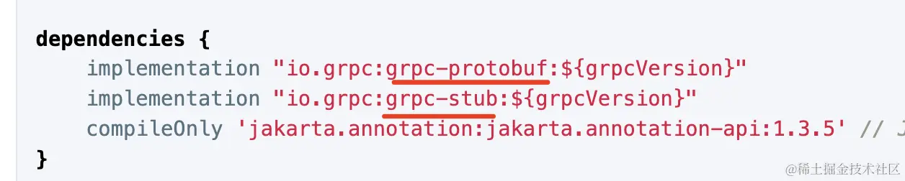

# 基于 gRPC 的远程方法调用。

通过 protocol buffer 的语法定义通信数据的格式，比如 package、service 等。

然后 server 端实现 service 对应的方法，client 端远程调用这个 service。

比如在 java 的 spring 里，需要安装这两个依赖：

然后也是定义这样的 proto 文件：

之后定义对应的 service：

和 node 里差不多。

这样就可以实现在 java、node、go、python 等多种语言之间实现微服务的远程方法调用。